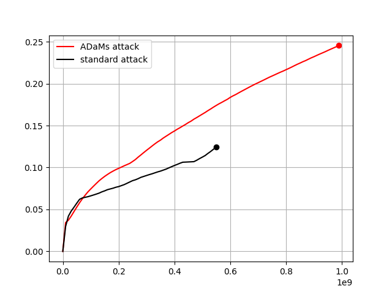

# Adaptive, Dynamic Mangling rules: **ADaMs**

Official repo for the *"[Reducing Bias in Modeling Real-world Password Strength via Deep Learning and Dynamic Dictionaries](https://arxiv.org/abs/2010.12269)"* by [Dario Pasquini](https://pasquini-dario.github.io/me/), Marco Cianfriglia, [Giuseppe Ateniese](https://web.stevens.edu/facultyprofile/?id=2182) and [Massimo Bernaschi](https://www.iac.rm.cnr.it/~massimo/Massimo_Bernaschi_home_page/Welcome.html) to be presented at USENIX Security 2021

⚠️ **Disclaimer:** This code is aimed at reproducing the results reported in our paper as well as support security analysis in the academic context.  We are working on a complete re-implementation of the software that will be applicable in actual password recovery applications. [Stay tuned 🎶](https://github.com/TheAdamProject/AdamTheFirstCracker/).

# Run the ADaMs Attack


All the materials to run the ADaMs Attack is contained in *AdamAttack* directory. 
To be able to run the attack the following prerequisites must been satisfied:

* gcc/g++
* Python 3.x
* TensorFlow **2.x**
* CUDA (if TensorFlow-GPU)

⚠️ We tested the code only on *ubuntu* >= 18.x. 

To compile the binary, use the Makefile, e.g.:

> cd AdamAttack; make

This produces a directory *bin* containing a binary file *AdamAttack* that you can run to launch the attack.

The binary accepts the following input parameters:
* **-r** an hashcat rules-set e.g., *generated.rule*.
* **-w** the dictionary/worlist for the attack
* **--hashes-file** the file containing the attacked set of password. Referred as *X* in the paper. **(⚠️ It must contain plaintext passwords, no password hashes)**
* **--output-guessed-file** the file to store the password guessed by AdamAttack. Default it is the stdout. This is an optional parameter. 
* **-a** the attack mode. Accepted values are 0=standard, 9=adams. The default value is adams.
* **--max-guesses-pow** the exponent of the power of 10 that defines the maximum number of guesses.
* **--config-dir** the path of the directory containing the trained model, the  rules file and the budget file. It works only with adam attack-mode.
* **--daemon-port** the binding port of the python daemon that does the inference. It works only with adam attack-mode.
* **--model-path** the pathname of the trained-model. It works only with adam attack-mode.
* **--budget** the attack budget. It works only with adam attack-mode.

For instance:
> cd AdamAttack/ <br>
> ./bin/AdamAttack -a 9 -w WORDLIST.txt --config-dir MODELs/PasswordPro_BIG/ --hashes RockYou.txt

⚠️ To note: The *AdamAttack* writes on stdout (or in output-guessed-file if set) only the password **guessed** during the attack. 


### Pre-trained Models
Pre-trained models in Keras format, along with rules files and default parameters, are available:

* [*PasswordPro_SMALL*](https://kelvin.iac.rm.cnr.it/AdamsPreTrainedKerasModels/PasswordPro_SMALL.zip) 41MB based on *InsidePro-PasswordsPro.rule*
* [*generated_SMALL*](https://kelvin.iac.rm.cnr.it/AdamsPreTrainedKerasModels/generated_SMALL.zip) 91MB based on *generated.rule*
* [*generated2_BIG*](https://kelvin.iac.rm.cnr.it/AdamsPreTrainedKerasModels/generated2_BIG.zip) 826M based on *generated2.rule*

Smaller models will be released soon.

Each pre-trained model is represented with a directory. These directories can be used with the **--config-dir** parameter.

### Run a test

Inside the directory *./AdamAttack/Test* you can run a scripted test and check if it is everything sound. Here, some instructions:

0. (After the code for the attack has been compiled)
1. cd into */AdamAttack/Test*
2. download the model, dictionary (phpBB) and attacked set (RockYou) by running: *./setup.sh*. 
3. Then, lunch the attack by running: *./run.sh*. It will take some time.

At the end of the process, a file called *adams_vs_standard_test.png* should appear in *./AdamAttack/Test*. The plot reported in the image should be something like this:
<p align="center">
  
</p>

# Train your model (Adaptive Mangling Rules)

In order to train your model, you have to create a training set and a validation set first.

## Creating a training set

The directory *MakeTrainingset* contains the necessary code to produce the training sets. The script based on MPI, thus a suitable implementation of MPI should be installed in your system.  

The code can be compile using the makefile into the directory e.g.,:

> cd MakeTrainingset; make 

This produces a directory *bin* containing a binary file *makeTrainingsetMPI* that you will run to produce your training set. 

The binary takes as input different mandatory parameters:

* **-w** the dictionary used to create the training set. Referred as *W* in the paper.
* **-l** the attacked set of passwords used to create the training set. Called $X_{A}$ in the paper.
* **-r** an hashcat rules-set e.g., *generated.rule*. 
* **-o** output directory, where to write the training set files.

For instance:
> mpirun -np 5 -w WORDLIST.txt -l ATTACKED_SET.txt -r RULES.rule -o OUTPUTDIR

## Training the model
After you have created one training set and at least one validation set (used as early-stopping criteria) with *makeTrainingsetMPI*, you have to craft a configuration file for the training process. 

A template for such a configuration file is *NeuralNet/CONFs/BIG_bn2.gin*. This contains all the hyper parameters and information needed to train a new model. 

⚠️ **TO NOTE:** Here, the parameters *setup.train_home* and *setup.test_homes* must be set with the path of the training set folder and the validation set folder (even more than one) respectively. For instance:

> setup.train_home = "./trainset/" <br>
> setup.test_homes = [ "./validation1/", "./validation2/"]


Once create a suitable configuration file, you can start the training using *train.py* in *./NeuralNet/*. This takes as input the path to the configuration file e.g.,:

> python train.py CONFs/my_BIG_bn2.gin

The script saves checkpoints and logs for the training process in *NeuralNet/MODELs/CHECKPOINTS*. These can be visualized with tensorboard. At the end of the training, it will save a keras model in  *NeuralNet/MODELs/SAVED_MODELS*.

# Cite the paper
This is the official repository of the paper *"Reducing Bias in Modeling Real-world Password Strength via Deep Learning and Dynamic Dictionaries"* to be presented at USENIX Security 2021.
If you use this tool for your research activity, please cite our paper
```
it will appear soon
```

# "Standing on the shoulders of giants"
Our software is built on top of **hashcat-legacy**.
<p align="center">
  
</p>
